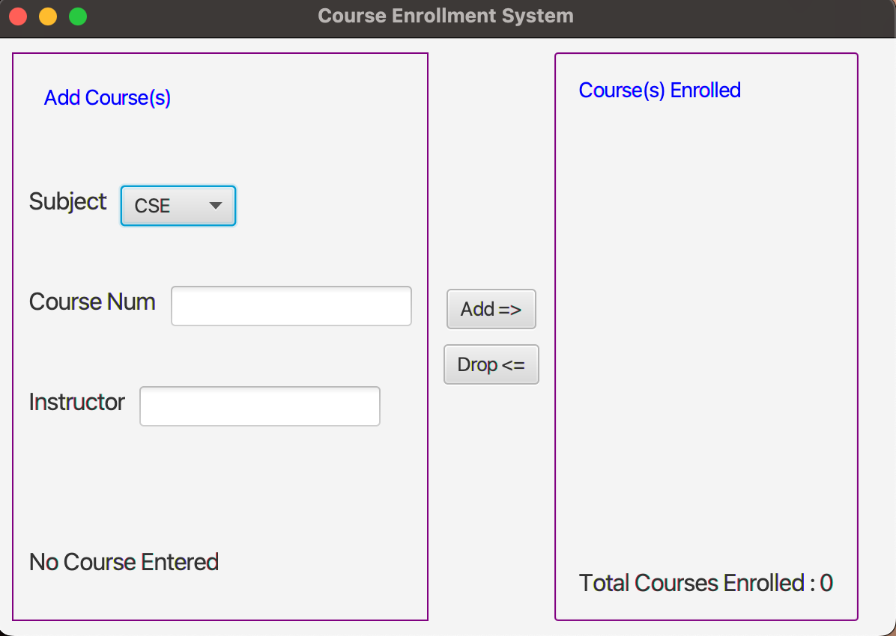

# CourseEnrollmentApp
It is a user-friendly JavaFX application that allows users to efficiently to add, drop, and track enrolled courses. Simplify your course management with this interactive and visually appealing JavaFX tool.

## Features 
1) The application's user interface. 
2) Implementation of the ComboBox. 
3) Implementation of Course Addition. 
4) Handling duplicate courses. 
5) Handling Incomplete Information. 
6) Implementation of the Course Deletion. 
7) Course Number Error Handling. 
